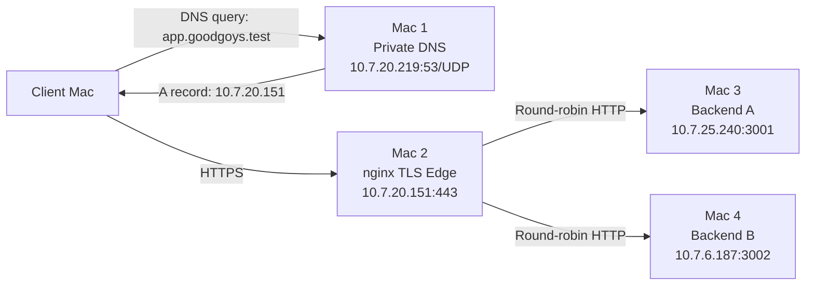

## Network Topology

| Layer | Source | Destination | Port |
|---|---|---|---|
| DNS query | Client ephemeral UDP port | Mac 1 | UDP 53 |
| DNS response | Mac 1 UDP 53 | Client ephemeral UDP port | UDP |
| TCP handshake | Client ephemeral TCP port | Mac 2 | TCP 443 |
| TLS handshake | Client ephemeral TCP port | Mac 2 | TCP 443 |
| HTTPS request | Client ephemeral TCP port | Mac 2 | TCP 443 |
| Backend connection | Mac 2 ephemeral TCP port | Mac 3 or Mac 4 | TCP 3001 or 3002 |